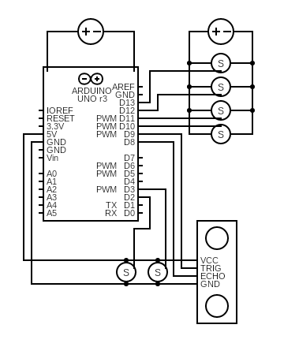

# IGOR Tree Climber
## Introduction
This how-to guide shows the steps needed to program a tree clibing robot with two gecko inspired grippers and a flippong body.

## Table of Contents
1. [Hardware Requirements](#hardware-requirements)
2. [Software Requirements](#software-requirements)
3. [Circuit Diagram](#circuit-diagram)
4. [Code Explanation](#code-explanation)
5. [Usage Instructions](#usage-instructions)
6. [Contributing](#contributing)
7. [License](#license)

## Hardware Requirements
- Arduino Uno Rev 3
- 2 Micro Servos
- 4 Standard Parallax Servos
- Ultrasonic Sensor (HC-SR04)
- Breadboard and Jumper Wires
- 5V Power Supply for Servos

## Software Requirements
- Arduino IDE (with included Servo Library)

## Circuit Diagram

## Code Explanation
### Setup
The setup() function attaches the sensor and servo pins as well as setting all servos to 0&deg,.

### Loop
The loop() function is where climbing occurs, by reading the distance to the canopy through the ultrasonic sensor measurements, and following a process to climb up if the distance is large, and down after the distance has been achieved.

### Functions
- `flip()`: Rotates the servos to flip the robot's grip.
- `unflip()`: Rotates the servos back to the original position.
- `releaseGrip(Servo theServo)`: Gradually releases the specified grip.
- `grip(Servo theServo)`: Gradually tightens the specified grip.
- `printDistance()`: Measures and prints the distance from the ultrasonic sensor.

## Usage Instructions
1. **Connect the Components**: Assemble the circuit as per the diagram.
2. **Upload the Code**:
    - Open the Arduino IDE.
    - Copy the provided code into the IDE.
    - Upload the code to the Arduino board.
3. **Power the Servos**: Ensure the servos have adequate power.
4. **Run the Project**: Place the robot in front of an object. It will climb if the distance is greater than 50 cm, and descend if it reaches the top.

## Contributing
We welcome contributions! Please fork this repository and submit a pull request. For major changes, please open an issue first to discuss what you would like to change.

## License
This project is licensed under the MIT License - see the [LICENSE](LICENSE) file for details.
